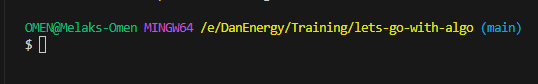
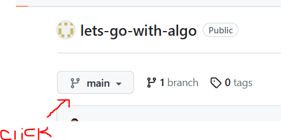

# Lets Go With Algo

To use this teaching material effectively, it is recommended to follow the setup instructions below to have access to and utilize the materials and/or tools present here.

## SETTING UP ON YOUR LOCAL

1. Download and Install GIT on your local machine: [GIT DOWNLOAD](https://git-scm.com/)

2. Setup the github CLI to manage credentials effectively on your local: [GITHUB CLI](https://github.com/cli/cli#installation)

3. Follow instructions on cashing(saving) your credentials on your local: [SAVING YOUR ACCESS LOCALLY](https://docs.github.com/en/get-started/getting-started-with-git/caching-your-github-credentials-in-git?platform=windows)

4. Cloning(copying) the repository(stored folders) on to your local machine: 
    * On the terminal COPY and PASTE this command and press ENTER
        >git clone https://github.com/danenergy-stu1/lets-go-with-algo.git

5. Creating your own branch for your work:
    * On the terminal go to the folder(directory) of the repository you cloned above: **lets-go-with-algo**. You should be able to see something like this:
    
    * Change everything with <> and replace with what is asked in this command:
        >git checkout -b ***\<your name\>***-***\<your father's name\>***
    - example:
        >git checkout -b ***biruk***-***temesgen***
    * COPY and PASTE the command, 
    * and press **ENTER**
    * You should be able to see something like this on the terminal:
    

6. To test your connection works, do these 
    1. COPY and PASTE the following command onto the terminal and press **ENTER**. Don't forget to replace <> with ***YOUR*** name.
        >touch ***\<your name\>***-***\<your father's name\>***-README.md
    2. ***OPEN*** the file in your favorite text editor and **write** your *name* and *age* inside and ***SAVE*** it. ***CLOSE*** the file.
    3. Your are now ready to ***PUSH*** your new file to the **CLOUD**!
    4. Type the following commands on the Terminal and press ***ENTER***
        >git add .

        >git commit -m "my first git commit!"
        
        >git push
    5. Once this is successful, you can go to the repository and see your file: 
        * ***CLICK*** > [LETS GO WITH ALGO](https://github.com/danenergy-stu1/lets-go-with-algo)
        * ***CHANGE*** the "main" branch to your branch **(the one with your name)** on the repo:
        
        * Find your file and look inside!
---

### CONGRATULATIONS, YOU ARE DONE AND READY!
---
